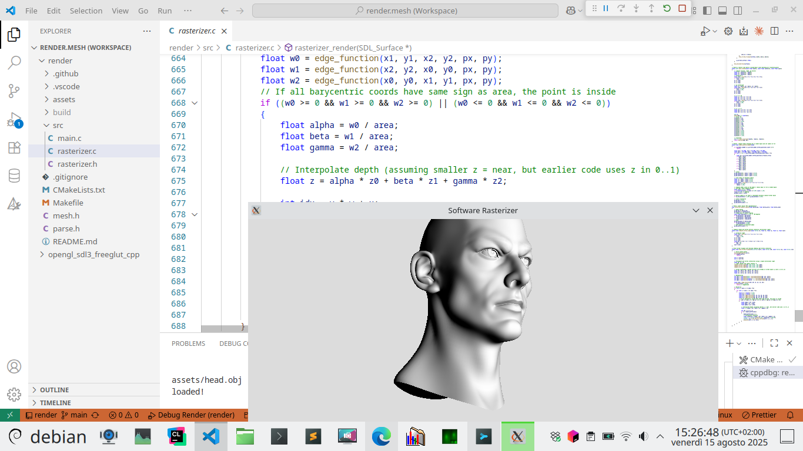

# C99 SDL3 Software Rasterizer

This project is a C99 application using SDL3 (no OpenGL) that implements a CPU-based software rasterizer with z-buffer, 3D transformations (rotation, translation), triangulated indexed mesh rendering, greyscale output, and normal-based Gouraud shading.



## Features

- CPU software rasterizer (no OpenGL)
- Z-buffer for depth
- 3D transformations: rotation, translation
- Triangulated indexed mesh rendering
- Greyscale output
- Gouraud shading based on vertex normals

## Build Instructions

- Requires: SDL3 development libraries (system package via pkg-config **or** fetch from git), C99 compiler (e.g., gcc)

### Default: Use System SDL3 (Recommended)

By default, the build uses SDL3 from your system via pkg-config. Install SDL3 development files using your package manager:

```
# Example for Debian/Ubuntu:
sudo apt install libsdl3-dev
```

Then build with CMake:

```
cmake -S . -B build
cmake --build build
```

### Optional: Use SDL3 from Git

If you want to fetch and build SDL3 from the official git repository (e.g., for latest development version), configure CMake with:

```
cmake -S . -B build -DUSE_SDL3_FROM_GIT=ON
cmake --build build
```

This will download and build SDL3 as part of the build process.

If neither pkg-config nor git is available, the build will fail with an error.

## Usage

- Run the executable to see a sample mesh rendered with transformations and shading.

## License

This project and all files in the repository are dedicated to the public domain under CC0 1.0 Universal. See the `LICENSE` file for details.
